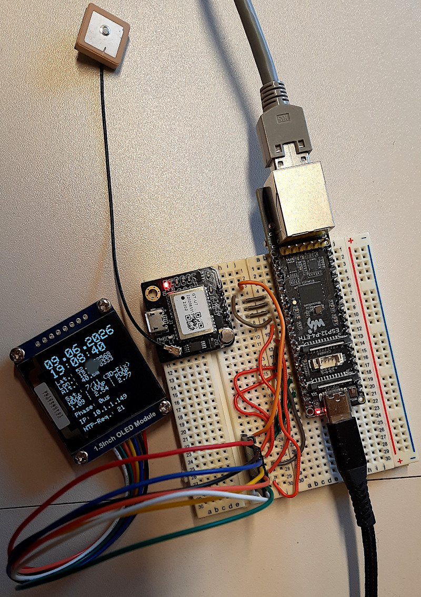
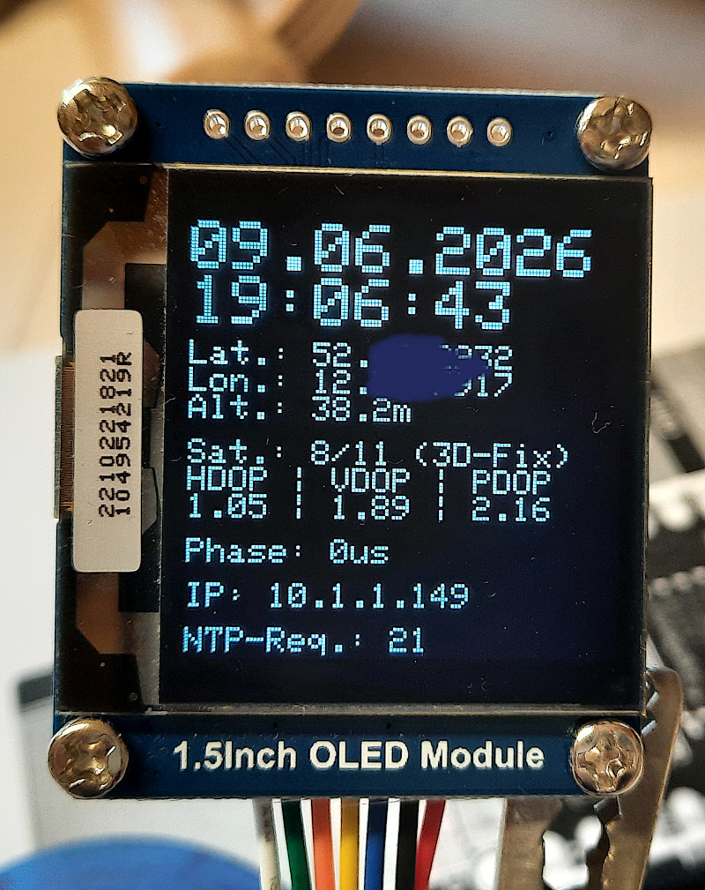
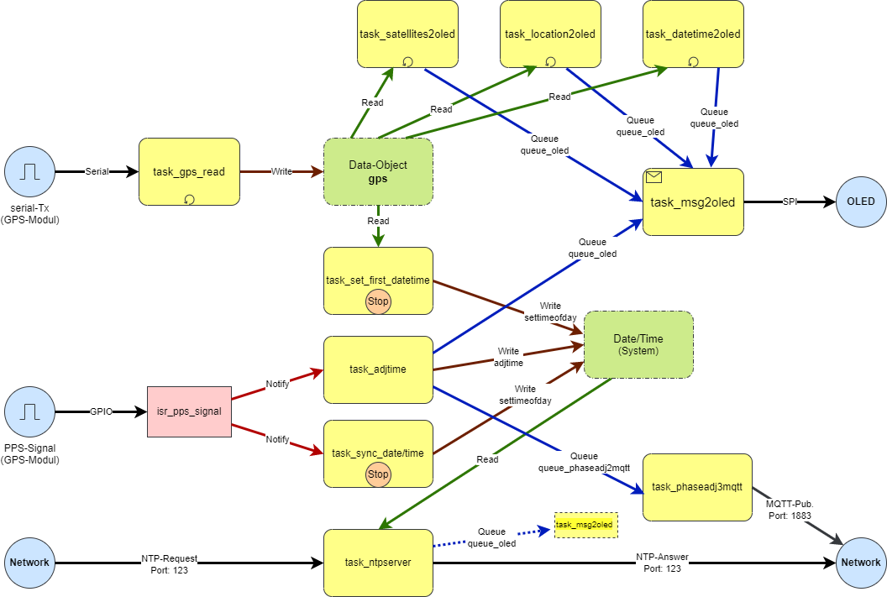
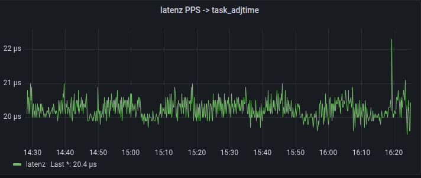
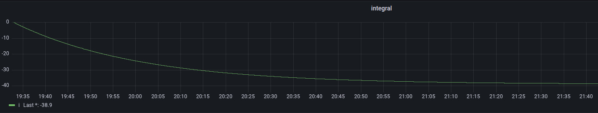
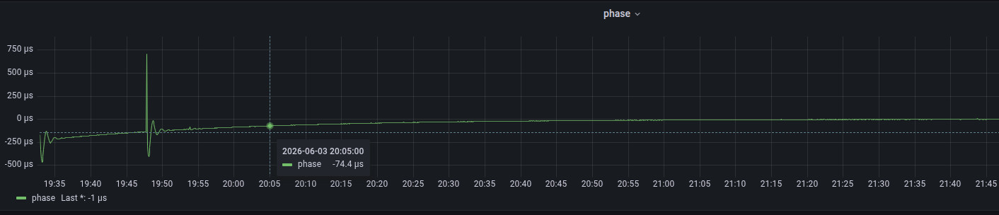

# GPS-Uhr mit NTP-Server

## Einführung

Eins der immer wiederkehrenden Probleme bei jedem Uhrenprojekt ist, wie setzt man initial Datum/Uhrzeit und hält diese dann auch synchon? Primitivste Methode wäre die Eingabe via Taster o.ä. zur initialen Eingabe und der Einsatz eines halbwegs genauen RTC-Bausteins, um für einen längeren Zeitraum eine einigemaßen genaue Uhrzeit zu erhalten.

Um diesen Prozess zu automatisieren, kann man aber auch auf extern verfügbare Zeitnormale (z.B. [DCF77]([DCF77 – Wikipedia](https://de.wikipedia.org/wiki/DCF77)), [GPS](https://de.wikipedia.org/wiki/Global_Positioning_System), [NTP](https://de.wikipedia.org/wiki/Network_Time_Protocol)) zurückgreifen. Jede dieser Automatisierungsmethoden erfordert meist spezielle Komponenten, die im Projekt hardwareseitig zu integrieren und softwareseitig anzusteuern sind.

Für dieses Uhrenprojekt wurde ein GPS-Modul verwendet, welches diverse [NMEA](https://de.wikipedia.org/wiki/NMEA_0183)-Informationen aus den empfangenen Positionsdaten mehrerer GPS-Satelliten generiert und über eine seriellen Schnittstelle ausgibt. Zusätzlich wird von dem GPS-Modul auch ein [PPS-Impuls](https://en.wikipedia.org/wiki/Pulse-per-second_signal) erzeugt, mit dem man eine hochgenaue Synchronisation der Uhrzeit realisieren kann.

Und wenn wir dann schon eine hochgenaue Uhr haben, die auch über das Netzwerk (WLAN oder Ethernet) erreichbar ist, kann man sie gleich so erweitern, dass sie einen NTP-Dienst zur Verfügung stellt, über den andere Uhren, Rechner etc. im Netz die genau Uhrzeit beziehen können. 

## Hardware

Für diesen Projekt würden folgende Hardware-Komponenten verwendet:

- [ESP32-P4-ETH](https://docs.waveshare.com/ESP32-P4-ETH) als zentrale Steuereinheit, welche auch eine Ethernet-Schnittstelle besitzt
- GT-U7 (GPS-Modul mit herausgeführten PPS-Signal)
- [OLED SSD1327](https://www.waveshare.com/wiki/1.5inch_OLED_Module) als Ausgabemedium für diverse Informationen

Die Verkabelung der einzelnen Komponenten untereinander ist aus den entsprechenden Stellen im Quelltext der Firmware ablesbar.

(Aufbau auf einem Breadboard)

## Software

Die Abläufe innerhalb der Uhren-Firmware sind konsequent mit den entsprechenden Mechanismen von [FreeRTOS](https://www.freertos.org/) umgesetzt. Die einzelnen Funktionen wurden jeweils als FreeRTOS-Tasks implementiert, welche dann via Queues, Signalen etc. untereinander kommunizieren.

Folgende Tasks sind dazu implementiert worden:

* `task_gps_read`: fortlaufender Empfang der NMEA-Informationen aus dem GPS-Modul via serieller Schnittstelle und deren Encodierung

* `task_set_first_datetime`: einmaliges, initiales Setzen Datum/Uhrzeit aus NMEA-Daten des GPS-Moduls (wenn ein sinnvolles Datum/Uhrzeit erkannt wurde)

* `task_sync_datetime`: einmalige, initiale Synchronisation der Uhrzeit mittels gültigem PPS-Signal (getriggert durch Interruptroutine `isr_pps_signal`)

* `task_adjtime`: fortlaufende Synchronisation der Uhrzeit mittels gültigem PPS-Signal (getriggert durch Interruptroutine `isr_pps_signal`)

* `task_ntpserver`: einfacher NTP-Server 

* `task_msg2oled`: (asynchrone) Ausgabe folgender Informationen auf OLED:
  
  * aktuelles Datum/Uhrzeit (aus `task_datetime2oled`)
  
  * GPS-Koordinaten der momentanen Position (aus `task_location2oled`)
  
  * Informationen zu Satelliten und Qualität der Positionsbestimmung (aus `task_satellites2oled`)
  
  * "Phaseverschiebung" zwischen PPS-Signal und Uhrzeit (aus `task_adjtime`)
  
  * Status der Ethernet-Schittstelle (aus `eth_event`)
  
  * Anzahl Zugriffe auf NTP-Server (aus `task_ntpserver`)
    
    
    
    (Ausgaben auf dem OLED; die einzelnen "Informationsblöcke" sollten selbsterklärend sein...)
- `task_phaseadj2mqtt`: Senden von diversen Informationen aus `task_adjtime` (Phase, adjtime-Wert, Reglerzustände, Latenz zw. PPS-Interrupt und dessen Verarbeitung) via MQTT

(Ein etwas "wirres" Bild, welches das Zusammenspiel der FreeRTOS-Tasks verdeutlichen soll)

## Wie genau muss "die Zeit" eigentlich sein?

Für eine reine Uhrenanzeige dürften die Größe der Abweichungen zu einem [Zeitnormal](https://de.wikipedia.org/wiki/Zeitnormal) nicht besonders ins Gewicht fallen. Ich behaupte mal, dass Abweichungen von ein paar 10ms nicht auffallen und damit für den "täglichen Bedarf" nicht relevant sind. Die Differenz zum Zeitnormal sollte aber im Laufe der Zeit möglichst nicht ansteigen ([Drift](https://de.wikipedia.org/wiki/Drift_(Messtechnik))), sich also selbst regulieren können.

Spannender wird es, wenn unterschiedliche und untereinander unabhängige Komponenten im Verbund  Steuerungsaufgaben übernehmen und/oder Messwerte sammeln sollen. Hier wäre es schon wünschenswert, dass alle Komponenten auf <u>eine gemeinsame Zeitbasis</u> synchronisert sind, um Ereignisse "treffsicher" zu generieren bzw. auf diese reagieren zu können. Die protokollierten Ereignisse und Messwerte sollten untereinander zeitlich zuordenbar sein. Handelt es sich um globalere Geschichten, sollte man darüber nachdenken, auf <u>das Zeitnormal</u> abzugleichen.

Wie groß die Abweichung vom Zeitnormal bzw. der Zeitbasis insgesamt und, aus Komponentensicht, untereinander sein darf, hängt von dem zu steuernden/beobachtenden Prozess ab. Es ist schon ein Unterschied, ob man seine Smarthome-Komponenten betrachtet oder eine Rakete sicher und zielgenau auf dem Mond ankommen lassen möchte.

## Welche Genauigkeit erreicht diese Uhr?

Von der Einordnung handelt es sich hier um einen [Stratum-1](https://de.wikipedia.org/wiki/Network_Time_Protocol#Grundlagen)-Zeitserver, da die interne Uhr, und damit auch der implementierte NTP-Server, unmittelbar an ein Zeitnormal (hier die Atomuhren der GPS-Satelliten) gekoppelt ist. Idealerweise, sogar an das PPS-Signal des GPS-Moduls.

Die Genauigkeit der Uhr hängt u.a. von folgenden Faktoren ab:

- Genauigkeit des PPS-Signals (Konstanz der 1s-Zyklus)  --> die Unsicherheit liegt im einstelligen Nanosekunden-Bereich, ist also vernachlässigbar

- [Jitter](https://de.wikipedia.org/wiki/Jitter) während der Verarbeitung innerhalb des Gesamtsystems; zusammengesetzt aus:
  
  - Latenz zwischen PPS-Interrupt und tatsächlicher Verarbeitung --> hier realtiv konstant ca. 20-22 Mikrosekunden (gemessen)
    
    

- "zufällige" Verzögerungen durch nicht identische Programmdurchläufe bei der Verarbeitung eines PPS-Signals (z.B. if/then/else)

- Einflüsse durch den Scheduler des unterlagerten FreeRTOS (welche Task ist gerade aktiv, Taskreihenfolge, Blockungen etc.); hier könnte man sicherlich noch etwas verbessern (Prioritäten, CPU-Verteilung u.ä.)

- [Auflösung](https://de.wikipedia.org/wiki/Aufl%C3%B6sung_(Messtechnik)) der internen Timer, die zur Darstellung der Zeit und zur Messung von Zeitabständen verwendet werden --> ESP32: jeweils kleinste Auflösung 1 Mikrosekunde

- Ungenauigkeit der verwendeten internen Timer des ESP32 --> Ich habe bei mir mit der Funktion `micros()` relativ konstant eine Zeit von 999 962 Mikrosekunden, also 38 Mikrosekunden zu kurz, zwischen zwei PPS‑Signalen gemessen.
  
  
  
  (Der integrale Teil des PI-Reglers in `task_adjtime` nährt sich diesen "ominösen" 38 Mikrosekunden)

- Äussere Einflussfaktoren, z.B. Temperaturschwankungen --> könnte man sicherlich durch eine entsprechende Regelung kompensieren; aber wir wollen nicht übertreiben!

Das alles "betrachtet", dürfte mit Sicherheit eine Uhr und einen NTP-Server ergeben, die/der für den "Hausgebrauch"" ausreichend ist und dessen Ungenauigkeit, nach einer gewissen Zeit des Einschwingens des PI-Reglers in `task_adjtime`, im zweistelligen Mikrosekundenbereich liegt. Und, großer Vorteil, die Uhr driftet über die Zeit nicht weg, sondern synchronisiert sich immer wieder mit dem PPS-Signal des GPS-Moduls!

(PI-Regler-Verhalten der Phasen-Verschiebung in `task_adjtime` über die Zeit; beginnend mit dem Start des ESP32...)

---

Uwe Berger; 2026
